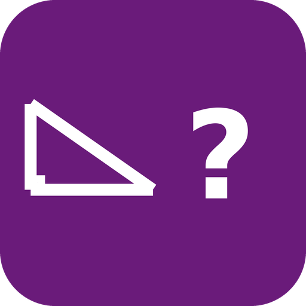

#  Geometry Practice

Interactive geometry quizzes and teach-then-practice - glossary term
recognition, area/perimeter/circumference calculation, and
Pythagoras' theorem. Fully offline, available in English, Danish,
German, French, and Spanish.

[](https://github.com/andlo/ovos-skill-geometry-practice/actions/workflows/test.yml)
[](https://pypi.org/project/ovos-skill-geometry-practice/)

- [Depends on ovos-skill-geometry](#depends-on-ovos-skill-geometry)
- [Quiz](#quiz)
- [Teach-then-practice](#teach-then-practice)
- [A real tolerance-band, for the first time in this project family](#a-real-tolerance-band-for-the-first-time-in-this-project-family)
- [Usage](#usage)
- [Install](#install)
- [Development](#development)

## Depends on ovos-skill-geometry

[ovos-skill-geometry](https://github.com/andlo/ovos-skill-geometry)
is a utility skill providing the glossary, formulas, and computation
functions this package quizzes on - the same relationship
`ovos-skill-geography-practice` has with `ovos-skill-geography`.
Installing this skill pulls that one in too, so both the knowledge
intents ("what is a rhombus") and the quiz intents below end up
active.

## Quiz

- `"quiz me on geometry terms"` - 5 multiple-choice questions ("which
  of these is the definition of a rhombus? A: ..., B: ..., C: ...").
  Distractors are OTHER glossary entries' REAL definitions from the
  same category (a shape's wrong options are other shapes, not random
  terms) - never invented text.
- `"quiz me on area and perimeter"` - 5 numeric questions mixing
  rectangle/square/triangle (exact grading) and circle (real
  tolerance-band grading, since pi makes the answer irrational).
- `"quiz me on pythagoras"` - 5 hypotenuse questions mixing known
  Pythagorean triples (exact) and arbitrary legs (tolerance-band).

## Teach-then-practice

The shared pattern from
[ovos-skill-math-practice](https://github.com/andlo/ovos-skill-math-practice)
(see its [issue #1](https://github.com/andlo/ovos-skill-math-practice/issues/1)):

- `"teach me about terms"` / `"teach me about 2d shapes"` / `"teach
  me about 3d shapes"` - recites each entry's definition, and for
  rectangle/square/triangle/circle, also the formula in words plus a
  worked example ("the area of a rectangle is length times width -
  the area of a rectangle with length 5 and width 3 is 15"). Say
  "repeat" to hear one again.
- `"teach me pythagoras' theorem"` - the theorem plus a worked 3-4-5
  example.
- `"quiz me on what you taught me"` then quizzes ONLY on what was
  taught - a mix of definition-recognition and (where applicable)
  numeric formula questions.

## A real tolerance-band, for the first time in this project family

Every other `*-practice` skill (math, geography) constructs its quiz
problems so the answer is always EXACT - no tolerance needed at all.
Geometry can't always do that: circle area/circumference (uses pi)
and a Pythagorean hypotenuse from non-triple legs are genuinely
irrational numbers. This skill uses a real percentage-based
tolerance-band (`within_tolerance()`, 2%) for exactly those two
cases - and still constructs everything else exact (rectangle/
square/triangle area/perimeter, triple-based Pythagoras) rather than
defaulting to tolerance everywhere. See DEVELOPMENT.md for the full
reasoning and how it's distinct from the float-representation
"epsilon guard" the rest of the family already uses for decimals.

## Usage
```
"quiz me on geometry terms"
"quiz me on area and perimeter"
"quiz me on pythagoras"
"teach me about terms"
"teach me pythagoras' theorem"
"quiz me on what you taught me"
"quiz mig i geometribegreber"        (Danish)
"lær mig om termer"                  (Danish)
"quiz mich zu geometriebegriffen"    (German)
"bring mir etwas über begriffe bei"  (German)
"interroge-moi sur les termes de géométrie"  (French)
"apprends-moi les termes"            (French)
"pregúntame sobre términos de geometría"  (Spanish)
"enséñame sobre términos"            (Spanish)
```

## Install
```bash
pip install ovos-skill-geometry-practice
```

## Development

See [DEVELOPMENT.md](DEVELOPMENT.md).

## Category
**Education**

## Tags
#geometry #math #education #quiz #pythagoras
